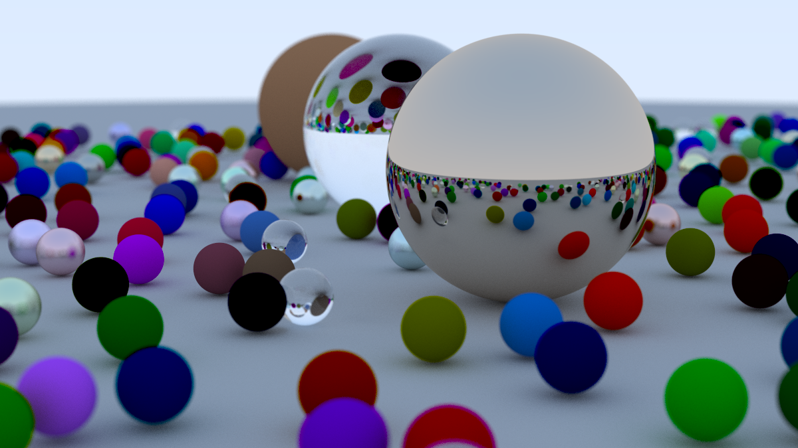

<h1 style="text-align: center;">Raytracer from scratch</h1> 

This is a personal project I'm trying to complete in my spare time. I'm trying to create ray tracing software with a variety of capabilities. 

---
### Features: 
| Features               | Description                       | Status |
|------------------------|-----------------------------------|--------|
| Antialising            | Smoothens edges of rendered images | ✔️      |
| Diffuse Materials      | Materials that scatter light equally in all directions | ✔️      |
| Metal                  | Materials that simulate metal properties | ✔️      |
| Dielectrics            | Non-metallic materials that do not conduct electricity | ✔️      |
| Positionable Camera    | Ability to control the position of the virtual camera | ✔️      |
| Defocus Blur           | Blur effect to simulate out-of-focus areas | ✔️      |
| Texture Mapping        | Applying textures onto 3D surfaces | ❌      |
| Motion Blur            | Simulating motion blur effect | ❌      |
| Bounding Volumes       | Geometric primitives used for collision detection and visibility determination | ❌      |
| Quadrilaterals         | Four-sided polygons | ❌      |
| Light                  | Sources of light in the scene | ❌      |
| Interface to control features | User interface for adjusting rendering features | ❌      |

---
### Dependencies
* [Eigen](https://eigen.tuxfamily.org/dox/index.html) _(version 3.4)_.

---
### Building the project
 If you wish to build the provided source, this project uses CMake. To build, go to the root of the project directory and run the following commands to create the debug version of every executable:

    $ cmake -B build
    $ cmake --build build

On Windows, you can build either `debug` (the default) or `release` (the optimized version). To specify this, use the `--config <debug|release>` option.

 ---
 

  
 

---

### Resources: 

* [_Ray Tracing in One Weekend_](https://raytracing.github.io/books/RayTracingInOneWeekend.html).

* [_Cherno Ray tracing_](https://www.youtube.com/watch?v=gfW1Fhd9u9Q&list=PLlrATfBNZ98edc5GshdBtREv5asFW3yXl).

* [_Graphics Programming Compendium_](https://graphicscompendium.com/index.html).

* [_Physically Based Rendering_](https://pbr-book.org/4ed/contents)